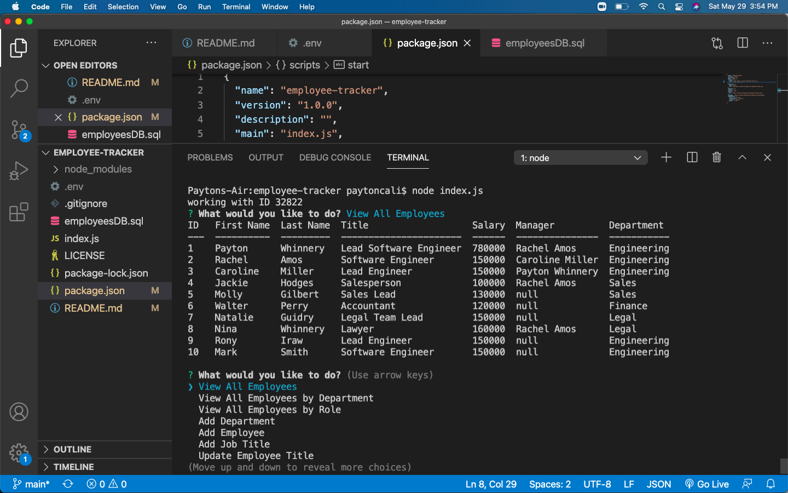

# Employee Tracker

## Table of Contents
  
1. [Description](#description)
2. [Installation](#installation)
3. [Usage](#usage)
4. [Contributors](#contributors)
5. [Testing](#testing)

[License](#license)

### Description
This application gives the user an easy system to tracker employees by role, department, and viewing all Employees. You can also add a new department, role, and employee. 
  
### Installation
first export=PASSWORD into your terminal then run node index.js
  
### Usage
This application is used to to track employees
  
### Questions

If you have any question you can reach me by: 

GitHub: www.github.com/paytoncali

Email Address: paytoncaliw@gmail.com

### Deployment

[App Link](https://github.com/paytoncali/employee-tracker.git)

[DEMO](https://drive.google.com/file/d/1L4EI4J6dxcP3hjv8Tw_3jWYikVR6cb7J/view)

### License
This application is covered by MIT

